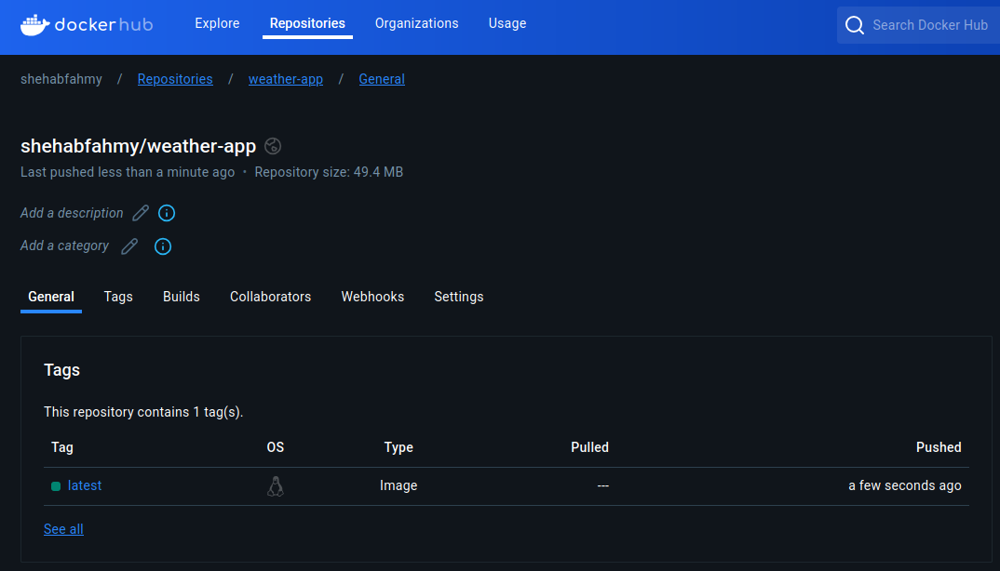

# CI/CD Pipeline for Automated Deployment of a Containerized Web Application
## Overview
Set up a CI/CD pipeline using Jenkins to automate the build and deployment of a Python web application. The pipeline pulls code from a GitHub repository, builds a Docker image, and pushes it to Docker Hub. Use an Ansible playbook to provision two Vagrant machines, install Docker, pull the image, and deploy the application in containers.


---

## Requirements
### 1) Clone the Application
Clone the public source code repository, then delete its `.git` directory:
```sh
git clone https://github.com/aliayman-225/Weather-App.git
cd Weather-App
rm -rf .git/
```

### 2) Project Structure
Clone this repository and organize your directory structure as follows:
```
|- Project_Jenkins_.../  # Project root
|--- Ansible/            # Contains all the files required for Ansible to function in the pipeline
|--- Screenshots/        # Stores the screenshots used to document this README.md file
|--- Secrets/            # Holds sensitive data and files (ignored by Git)
|--- Vagrant/            # Includes the Vagrantfile for creating virtual machines
|--- Weather_App/        # Contains the Python web application source code
|----- Dockerfile        # Used to containerize the application
|----- Jenkinsfile       # Retrieved by Jenkins when the pipeline is triggered
```

### 3) Containerization
Write a [Dockerfile](Dockerfile) to containerize the application.
#### Dockerfile Steps
1. Use `python:slim` base image, since it's a simple python application.
2. Create the working directory at `/app` inside the container.
3. Copy the application to the container.
4. Install application dependencies.
5. Document the port used by the application.
6. Define the container's start command by executing `app.py`.

### 4) Create a Private Repository
1. Create a new **private** repository in your GitHub account.
2. Push the source code along with the Dockerfile:
    ```sh
    git init
    git add .
    git commit -m "Source Code Added"
    git branch -M main
    git remote add origin git@github.com:ShehabFahmy/Weather_App.git
    git push -u origin main
    ```

---

## Implementation
### Vagrant and Oracle VirtualBox
Create two Vagrant machines with low specifications in the [Vagrantfile](Vagrant/Vagrantfile).
Since these machines will be used as Ansible agents, you need to configure them in the provision section of each machine by performing the following steps:
1. **Create an** `ansibleadmin` **user** with sudo privileges and no password to be used for Ansible provisioning.
2. **Set up SSH access** by copying the public key and pasting it into the `ansibleadmin` user's `authorized_keys` file.
You can then start the machines using one of the following commands:
- From the project directory:
  ```sh
  vagrant --chdir /Vagrant up
  ```
- From within the `/Vagrant` directory:
  ```sh
  vagrant up
  ```

---

### Jenkins
In this repository, Jenkins was used as a Docker container rather than being installed on the host machine. Therefore, Docker volume mapping was used to access Docker, which was already installed on the host machine.
```sh
docker network create jenkins-network
docker run -d \
  --name jenkins-for-odc-project \
  --network jenkins-network \
  -p 8080:8080 \
  -p 50000:50000 \
  -v /var/jenkins_home:/var/jenkins_home \
  -v /usr/bin/docker:/usr/bin/docker \
  -v /var/run/docker.sock:/var/run/docker.sock \
  -u root \
  jenkins/jenkins:lts
```
#### Jenkins Credentials
Some credentials are used throughout the pipeline. Make sure to add them first:
1. **GitHub Token** (username with password) – Required for pulling the code from a private repository.
2. **OpenWeatherMap.org API Key** (secret text) – Provides the application with data.
3. **Docker Hub Credentials** (username with password) – Used for pushing the Docker image to Docker Hub.
4. **Ansible SSH Private Key** (SSH username with private key) – Which was used earlier for configuring Vagrant VMs.
5. **Ansible SSH Public Key** (SSH username with public key) – Which was used earlier for configuring Vagrant VMs.
6. **Ansible Vault Secrets File Password** (secret text) – The password used to encrypt the secrets file (`ansible_secrets.yaml`), which contains the API key.
#### Continuous Integration (CI)
1. Pull the code from the private Git repository (requires a credentials token).
    - **Create a GitHub token**: Go to GitHub profile **Settings** > **Developer settings** > **Personal access tokens** > **Fine-grained tokens** > **Generate new token**.
        - Grant access to the web application repository only with **Read-Only** permission for "Contents".
    - **Create Jenkins Credentials**: Go to **Manage Jenkins** > **Credentials** > **System** > **Global credentials (unrestricted)** > **Add Credentials**.
        - Choose **Username with password**, then enter your username, the token as the password, and an ID to be used in the pipeline.
2. Build a Docker image.
3. Push the image to Docker Hub.
    - Docker Hub:

#### Continuous Deployment (CD)
Run the Ansible playbook to automate the deployment of the application to the target machines.
A Docker container using the `alpine/ansible:latest` image will be used to execute the Ansible playbook command instead of installing Ansible directly. The command used in the pipeline is as follows:
```sh
docker run --name ansible-container-for-deployment \
-v "\$(pwd)/:/ansible" \
-v "\$(pwd)/../Secrets:/ansible/../Secrets" \
-w /ansible \
alpine/ansible:latest \
ansible-playbook /ansible/playbook.yaml
```

#### Mailer
A Jenkins plugin called **Mailer** was used to configure email notifications for build results.
1. Go to **Dashboard** > **Manage Jenkins** > **Plugins** > **Available plugins**.
    - Search for **Mailer** and install it.
2. Go to **Dashboard** > **Manage Jenkins** > **System** > **E-mail Notification**.
    - SMTP server: `smtp.gmail.com`
    - Use SMTP Authentication: Add your email and Google **App Password**.
    - Use SSL
    - SMTP Port: `465`
3. In the pipeline, after the stages section, add:
    ```Groovy
    post {
        success {
            // Use the Mailer plugin to send email on success
            mail to: 'recipient@gmail.com',
                 subject: "Job '${env.JOB_NAME} [${env.BUILD_NUMBER}]' - Success",
                 body: "The job succeeded. Check details: ${env.BUILD_URL}"
        }
        failure {
            // Use the Mailer plugin to send email on failure
            mail to: 'recipient@gmail.com',
                 subject: "Job '${env.JOB_NAME} [${env.BUILD_NUMBER}]' - Failed",
                 body: "The job failed. Check details: ${env.BUILD_URL}"
        }
    }
    ```

#### Build Trigger using GitHub Webhook
##### Jenkins Configuration
1. First, push your [Jenkinsfile](Jenkinsfile) to the repository that will trigger the build.
2. In your pipeline, go to **Configure** > **Build Triggers**, and check **GitHub hook trigger for GITScm polling**.
3. In the pipeline section, choose:
    - Definition: `Pipeline script from SCM`
    - SCM: `Git`
    - Repository URL: `https://github.com/ShehabFahmy/Weather_App.git`
    - Credentials: The GitHub token used in the pipeline to clone the application.
    - Branch Specifier: `*/main`
    - Script Path: `Jenkinsfile`
4. Save the configuration.
##### Ngrok Configuration
Since Jenkins was used locally, GitHub wouldn't be able to access it. Therefore, a tunneling service such as Ngrok was used to expose `localhost:8080`.
1. Instead of installing the entire tool, an Ngrok container was used and added to the same Docker network as the Jenkins container:
```sh
docker run --rm -it \
--name ngrok-container-for-jenkins \
--network jenkins-network \
-e NGROK_AUTHTOKEN=$(cat ./Secrets/ngrok_authtoken) \
ngrok/ngrok \
http jenkins-for-odc-project:8080
```
- ***Note:*** Make sure to run the previous command in the project directory.
2. A new window will open in your terminal after executing the previous command:

3. Use the URL in the `forwarding` row to access the Jenkins server:

##### GitHub Webhook Configuration
1. Go to the repository **Settings** > **Webhooks** > **Add Webhook**:
    - Payload URL: `https://<your-ngrok-url>/github-webhook/`
    - Content type: `application/json`
    - Leave the rest as default.
2. Add webhook.
3. Refresh the page. You should see that it is working:


---

### Ansible
1. Configure Ansible ([ansible.cfg](Ansible/ansible.cfg)) and the [hosts file](Ansible/inventory.ini).
2. Create a [playbook](Ansible/playbook.yaml) that performs the following tasks on the target machines:
    - [install-docker](Ansible/roles/install-docker/tasks/main.yml): A role to install Docker.
    - [deploy-app](Ansible/roles/deploy-app/tasks/main.yml): A role that:
        - Pulls the Docker image from Docker Hub.
        - Adds *OpenWeatherMap.org* API key to `app.py`.
        - Runs a container of the web application.
    
---

## Final Outputs
<p align="center">
  <strong>Console Output</strong>
  <br>
  
</p>

<p align="center">
  <strong>Email Notification</strong>
  <br>
  
</p>

<p align="center">
  <strong>Website Deployment</strong>
  <br>
  
</p>

