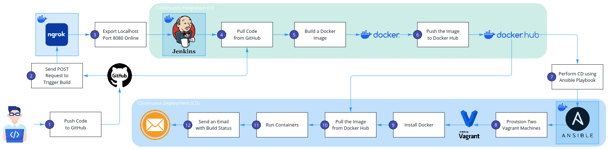

# Internship Tasks & Final Project
This repository contains my internship tasks and the final project, focusing on system monitoring, container performance analysis, and automated CI/CD deployment.

## Task 1: Create a System Monitoring Script
### Overview
A shell script to monitor system resources, generate a report, and send an e-mail alert if a threshold is exceeded.

### Features
- **Disk Usage Check:** Reports disk space usage for each mounted partition and alerts if usage exceeds a set threshold.
- **CPU Usage Check:** Displays the current CPU usage percentage.
- **Memory Usage Check:** Shows total, used, and free memory.
- **Process Monitoring:** Lists the top 5 memory-consuming processes.
- **Report Generation:** Logs system information in `/tmp/system_monitor.log`.
- **Enhancements:**
  - `-t`: Specify a disk usage warning threshold.
  - `-f`: Set the output log file name.

---

## Task 2: Monitoring Containers using Grafana
### Overview
A project to monitor container performance using **Grafana**, visualizing system resource usage under different workloads.

### Components
- **Stress Container:** Simulates a high-resource workload.
- **Light Container:** Runs a low-resource workload.
- **cAdvisor:** Collects real-time container metrics.
- **Metrics Collector:** Retrieves data from **cAdvisor**, converts metrics to percentages, and stores them in **PostgreSQL**.
- **PostgreSQL:** Stores processed container metrics.
- **Grafana:** Displays performance trends on dashboards.

---

## Final Project: CI/CD Pipeline for Automated Deployment of a Containerized Web Application
### Overview
A CI/CD pipeline built using Jenkins, Docker, and Ansible to automate the build, testing, and deployment of a containerized Python web application. This project streamlines the deployment process, ensuring continuous integration and delivery with minimal manual intervention.

### Pipeline Process
1. **GitHub Integration:** Jenkins pulls code from a GitHub repository.
2. **Docker Build & Push:** Builds a Docker image and pushes it to Docker Hub.
3. **Infrastructure Provisioning:** Uses Ansible to provision two Vagrant machines.
4. **Deployment:** Installs Docker, pulls the image, and deploys the application in containers.
5. **Webhook & Ngrok:** Triggers the Jenkins pipeline whenever code is pushed to GitHub using a webhook routed through an Ngrok tunnel.
6. **Notification:** Sends an email with the build status.

---
