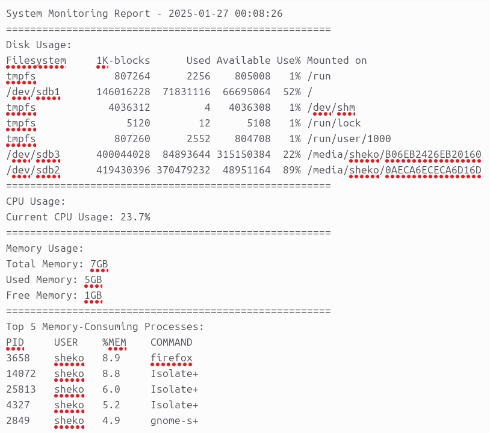
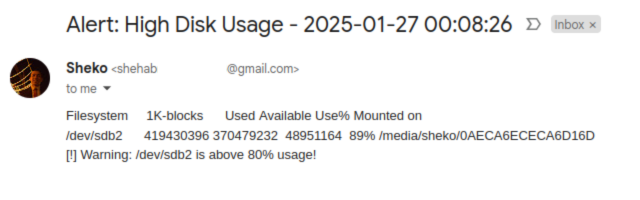

## Task: Create a System Monitoring Script
Write a shell script to monitor system resources, generate a report, and send an e-mail alert if a threshold is exceeded.
### Requirements
#### Script
The script should perform the following tasks:
1. Check Disk Usage:
- Report the percentage of disk space used for each mounted partition.
- Warn if usage exceeds a specified threshold (e.g., 80%).
2. Check CPU Usage:
- Display the current CPU usage as a percentage.
3. Check Memory Usage:
- Show total, used, and free memory.
4. Check Running Processes:
- Display the top 5 memory-consuming processes.
5. Generate a Report:
- Save the collected information into a log file (e.g., system_monitor.log) -> will be saved at `/tmp`.
6. Enhancements:
- Allow the user to pass optional arguments, such as:
    - `-t`: to specify the disk usage warning threshold.
    - `-f`: to set the output file name.
```sh
# The user may run the script in different ways, as follows:
# 1) ./script.sh
# 2) ./script.sh -t 80
# 3) ./script.sh -f output.log
# 4) ./script.sh -t 80 -f output.log
# 5) ./script.sh -f output.log -t 80

THRESHOLD=80
LOGS_FILE_NAME="sys_monitor.log"
if [[ $1 == "-t" ]]; then
    THRESHOLD=$2
    if [[ $3 == "-f" ]]; then
        LOGS_FILE_NAME=$4
    fi
elif [[ $1 == "-f" ]]; then
    LOGS_FILE_NAME=$2
    if [[ $3 == "-t" ]]; then
        THRESHOLD=$4
    fi
fi

# Corner Cases
# 1) Remove '%' if the user entered it with the number
lastChar=${THRESHOLD:${#THRESHOLD}-1:1}
if [[ $lastChar == '%' ]]; then
    THRESHOLD=${THRESHOLD:0:${#THRESHOLD}-1}
fi
# 2) Add ".log" to the output file name if not specified
isExtensionExists=$(echo $LOGS_FILE_NAME | grep ".log" | wc -l)
if [[ $isExtensionExists -eq 0 ]]; then
    LOGS_FILE_NAME="${LOGS_FILE_NAME}.log"
fi
```
##### Output

---
#### Cron Job
Make the script executable as a cron job that runs every hour and sends an email if the threshold is breached.
1. Open crontab:
```sh
crontab -e
```
2. Add a new cron job:
```
* */1 * * * absolute/path/to/Task_1/monitoring_script.sh
```
3. Save (Ctrl+S then Ctrl+X, for nano editor).
---
#### E-mail Alert
1. Create an App Password on your Google account and save the 16-character password for later (WITHOUT SPACES).
2. Install `ssmtp`:
```sh
sudo apt update
sudo apt install ssmtp -y
```
3. Configure `ssmtp.conf`:
- You have to switch to root user (`sudo su`) and open `vim /etc/ssmtp/ssmtp.conf`:
```
# Change mailhub to google's smtp server
mailhub=smtp.gmail.com:587

# Add Google user
AuthUser=sender@gmail.com
AuthPass=your_app_password

# Uncomment FromLineOverride
FromLineOverride=YES

# Add
UseSTARTTLS=YES
```
4. In your script, add the email sending logic:
```sh
if [ -n $DISKS_OVER_THRESHOLD ]; then
  TO="recipient@gmail.com"
  SUBJECT="Alert: High Disk Usage - `date +"%Y-%m-%d %H:%M:%S"`"
  BODY="$DISK_ALERT"
  echo -e "To: $TO\nSubject: $SUBJECT\n\n$BODY" | ssmtp $TO
fi
```
##### Output

---
