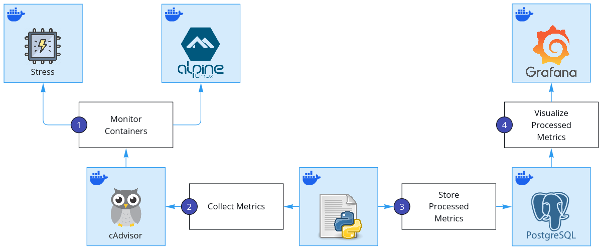

# Task: Monitoring Containers using Grafana

## Overview
This project demonstrates how to monitor container performance using **Grafana**, with metrics collected from containers under different workloads. The goal is to visualize and analyze resource usage, helping users understand how different workloads affect system performance.


### Components Used
- **Stress Container:** Simulates a high-resource workload to test system limits.
- **Light Container:** A low-resource workload for comparison.
- **cAdvisor:** Collects real-time container metrics, including CPU and memory usage.
- **Metrics Collector:** Retrieves data from **cAdvisor**, converts metrics to percentages, and stores them in **PostgreSQL**.
- **PostgreSQL:** Stores processed container metrics for analysis and visualization.
- **Grafana:** Displays performance trends using dashboards based on collected metrics.

---

## Project Structure
```
|- Task_2_Grafana_Monitoring/   # Project root
|--- Grafana/                   # Contains Grafana server configuration files
|----- data-source.yaml         # Configures Grafana data source automatically
|----- grafana-dashboard.json   # Predefined Grafana dashboard for easy import
|----- grafana-queries.txt      # Queries used to build visualizations in Grafana
|--- Metrics_Collector/         # Dockerfile and Python script for the metrics collector
|--- Screenshots/               # Contains screenshots used in this README.md file
|--- docker-compose.yaml        # Docker Compose file to deploy all services
```

---

## Run the Project  
Follow these steps to set up and run the project:
1. **Ensure a clean database setup**
   If the `Postgres_Data` directory exists, remove it to avoid conflicts. Run the following command in the project directory:
   ```sh
   sudo rm -rf Postgres_Data
   ```
2. **Build and start the necessary containers**
   This includes **Grafana**, **PostgreSQL**, **cAdvisor**, and the **Metrics Collector**:
   ```sh
   docker compose up --build
   ```
3. **Access the Grafana dashboard**
   Once the containers are running, open your browser and go to:
   ```
   http://localhost:3000
   ```
4. **Explore the data**
   - Import the existing [dashboard](Grafana/grafana-dashboard.json), or
   - Create a new one using the predefined [Grafana Queries](Grafana/grafana-queries.txt).

### Final Outputs
<p align="center">
  <strong>Grafana Dashboard</strong>
  <br>
  
</p>

<p align="center">
  <strong>cAdvisor Dashboard for App01</strong>
  <br>
  
</p>

The **cAdvisor Dashboard** above shows CPU usage metrics that match the calculations from the Python script, confirming accurate metrics scraping and analysis.

